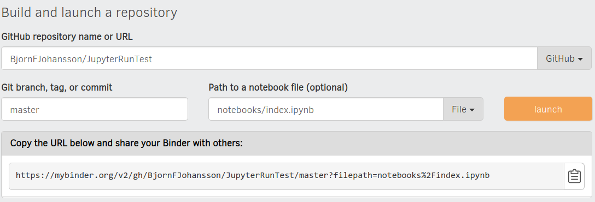

# JupyterRunTest

This repository has a collection of Jupyter notebooks:

[index](notebooks/index.ipynb)

[divbyzero2](notebooks/divbyzero2.ipynb)

[divbyzero](notebooks/divbyzero.ipynb)

[insubfoldr](notebooks/SubFolder/insubfoldr.ipynb)

These notebooks are tested regularly on a Linux continuous integration server hosted by Travis CI: 

This branch should work:

This branch should fail:

Alongside each notebook there is a html version with the same name but with a `.html` extension instead of `.ipynb`.

Notebooks can be explored live online using binder. Click on the binder badge and wait for binder to start.

Binder settings:

Project Organization
--------------------------

	├── ci.sh                   <= This script contains 
	├── environment.yml         <= Contains all dependencies to run notebooks
	├── data
	│   ├── raw                 <= raw data used in the project
	│   └── processed           <= processed data used in the project
	├── LICENSE
	├── nbcollector.py          <= Collects and prints markdown links to all notebooks in the repository.
	├── notebooks               <= Put Jupyter notebooks here.
	│   ├── divbyzero2.html
	│   ├── _divbyzero2.ipynb
	│   ├── divbyzero2.ipynb
	│   ├── divbyzero.html
	│   ├── divbyzero.ipynb
	│   ├── index.html
	│   ├── index.ipynb
	│   └── SubFolder
	│       ├── insubfoldr.html
	│       └── insubfoldr.ipynb
	└── references              <= Put all references such as papers, manuals etc.
	    └── binder.png          <= This image show basic binder settings

    ├── ci.sh                   <= This shell script creates a conda test enviroment based on the environment.yml file
    ├── environment.yml         <= Put all dependencies to run notebooks here
    ├── LICENSE                 <= Some liberal software licence
    ├── notebooks               <= Put Jupyter notebooks here.
    │   ├── data
    │   │   ├── processed      <= processed data used in the project
    │   │   └── raw            <= raw data used in the project
    │   ├── divbyzero2.html
    │   ├── divbyzero2.ipynb
    │   ├── divbyzero.html     <= a html version of a notebook 
    │   ├── divbyzero.ipynb    <= a notebook 
    │   ├── index.html
    │   ├── index.ipynb
    │   ├── nbcollector.py     <= This script can be run to collects and prints markdown links to all notebooks in the repository.
    │   ├── references         <= Put all references such as papers, manuals etc.
    │   │   └── binder.png
    │   └── SubFolder
    │       ├── deeper
    │       │   └── insubfoldr.ipynb
    │       ├── insubfoldr.html
    │       └── insubfoldr.ipynb
    └── README.md                              <= this file. Should have links to notebooks

--------------------------

<small>Project based on the <a target="_blank" href="https://drivendata.github.io/cookiecutter-data-science/">cookiecutter data science project template</a>. #cookiecutterdatascience</small>

